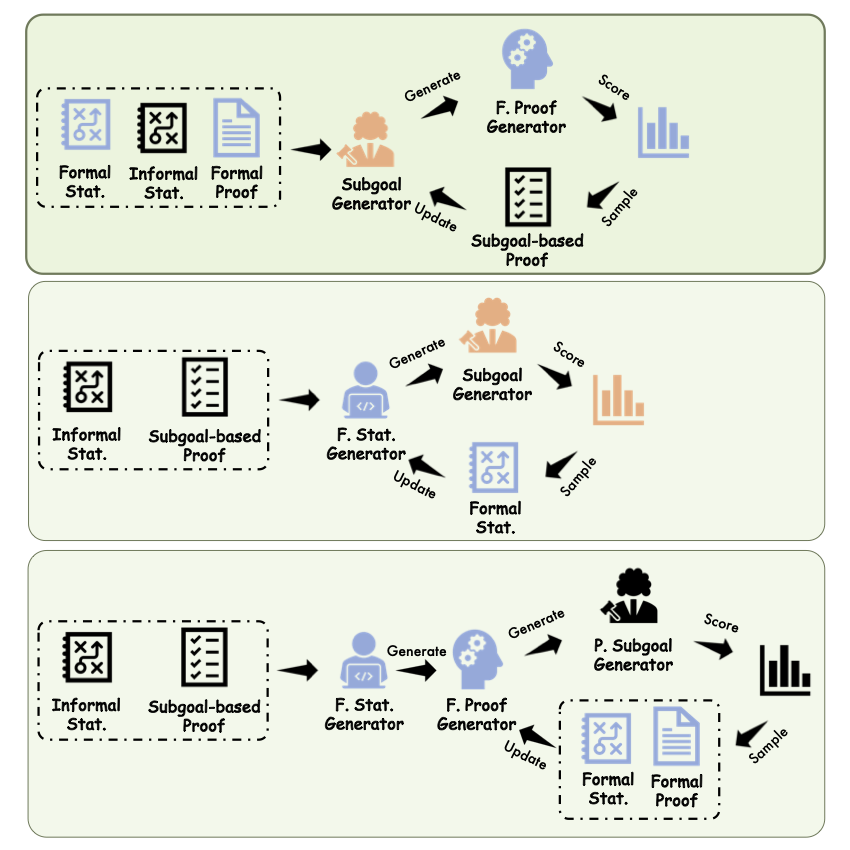

# SubgoalXL: Subgoal-based Expert Learning for Theorem Proving

<div align="center">


</div>

[](LICENSE)
[](DATA_LICENSE)

## Introduction

This repository contains the code and resources for our AI-powered theorem-proving project, designed to tackle complex formal proofs using language models.

For more details, please refer to our [paper](https://arxiv.org/abs/2408.11172).

<p align="center">



</p>

## Setup

To get started with model deployment and experimentation, follow these setup instructions.

### 1. Isabelle Environment Setup (<span style="color: #4169e1; font-weight: bold;">TODO</span>)

We provide a complete setup for the Isabelle environment to ensure smooth integration with the project’s scripts. Please refer to the [Isabelle pipeline](path/to/repo/isabelle_setup) for detailed instructions.

### 2. Conda Environment Setup

Ensure that you have a conda environment with PyTorch and CUDA installed. Then, run the following command to set up the required environment:

```bash
cd project_directory
pip install -r requirements.txt
```

## Data Resources

We provide curated datasets essential for initializing the expert learning phase. These datasets can be downloaded from our [datasets hub](https://huggingface.co/collections/xl-zhao/subgoalxl-66c84b77e0eaf131c0cdac15). The full data preparation pipeline for generating these datasets is located in [data preparation](data_preparation/README.md).

## Training

We offer a comprehensive training pipeline for model development. Please refer to the [training pipeline](training/README.md) to get started.

## Inference

Our inference pipeline is designed for applying models to new proof tasks efficiently. Please refer to the [inference pipeline](inference/README.md) for instructions.

## Verification

To ensure the correctness of generated proofs, we provide a verification pipeline. Details can be found in the [verification pipeline](verification).

## Model Weights

We provide our model weights, which you can use directly for model deployment and experimentation. The weights can be downloaded from our [model hub](https://huggingface.co/collections/xl-zhao/subgoalxl-66c84b77e0eaf131c0cdac15).

## Citation

If you use our code or data, please cite our paper:

```
@article{zhao2024subgoalxl,
      title = {SubgoalXL: Subgoal-based Expert Learning for Theorem Proving},
      author = {Zhao, Xueliang and Zheng, Lin and Bo, Haige and Hu, Changran and Thakker, Urmish and Kong, Lingpeng},
      journal={arXiv preprint arXiv:2408.11172},
      url={https://arxiv.org/abs/2408.11172}, 
      year = {2024},
}
```

## Acknowledgements

Our research was greatly accelerated by [SambaNova Systems](https://sambanova.ai)' advanced technology, which enabled us to surpass the 1000 tokens per second barrier for large language model inference. This capability was critical in generating complex formal statements and proofs with exceptional speed, leveraging the outstanding performance of the [SN20](https://sambanova.ai/products/sn20/), [SN30](https://sambanova.ai/products/sn30/), and [SN40](https://sambanova.ai/products/sn40/) series chips. 
